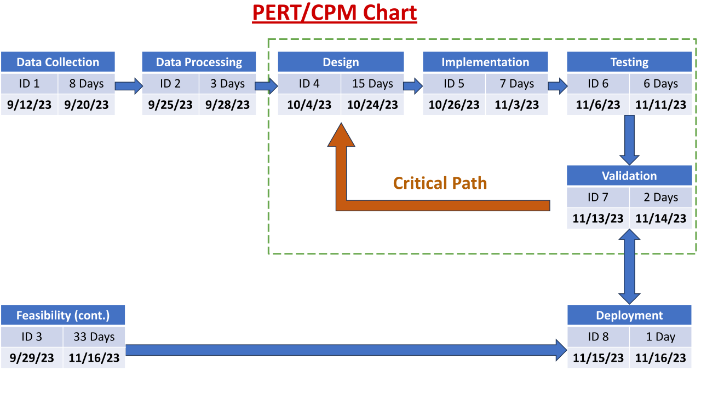

# Web-based GUI for Machine Learning Workflow/Pipeline

Professional software development project from the Fall 2023 semester at UAF.

## Development Instructions

- Clone repository: `gh repo clone jbonda/ml-workflow-pipeline`

#### Flask Application

###### Python

> [!NOTE]
> This project utilizes [`Pipenv`](https://pipenv.pypa.io/en/latest/) for managing virtual environments.
> You can install it with `pip install --user pipenv`.

- Navigate to the source directory: `cd ML_GUI`
- Install [dependencies](ML_GUI/Pipfile): `pipenv shell`
- Run program: `pipenv run flask --app server.py --debug run`

#### System Benchmarking

###### Node.js

- Navigate to the source directory: `cd benchmark/src`
- Install dependencies: `npm i`
- Run the development script: `npm run devstart`

###### Hybrid

- Supplementary resources are available within the [`benchmark`](https://github.com/jbonda/ml-workflow-pipeline/tree/main/benchmark) directory.

###### .NET

- [ML.NET Tutorial - Get started in 10 minutes](https://dotnet.microsoft.com/en-us/learn/ml-dotnet/get-started-tutorial/intro)

## Project Diagrams

